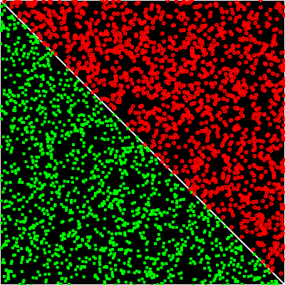
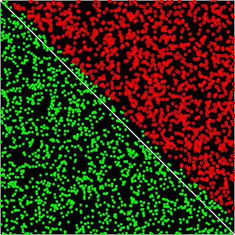

# NeuroNetworkApplication
A simple neuro network application for classification 

prerequisite:
Install cairo for drawing picture,please refer to "https://www.cairographics.org/download/".

# Steps:</br>
## 1.Compile and build Training application

```
g++ -std=c++11 -o cairoTraining mainTraining.cpp `pkg-config --cflags --libs cairo`
```
## 2.Run training application,and get training data output file "trainingData.txt"

```
./cairoTraining
```
(**_Here below is the random produced training data set_**):sparkles:



## 3.Copy training data "trainingData.txt" produced in step 1 to the same directory as mainNeuroNetwork.cpp,and execute command below:

```
g++ -std=c++11 -o neuroNetwork mainNeuroNetwork.cpp `pkg-config --cflags --libs cairo`
```
## 4.Construct and train a 3 layer neuro network model,2 inputs,1 output,1 hidden layer with 5 nodes including a bias node,and there is also a bias node in layer 1,so the neuro network is 3\*5\*1 model

```
./neuroNetwork
```
(**_Here below is the simulation result_**):ok_hand:


